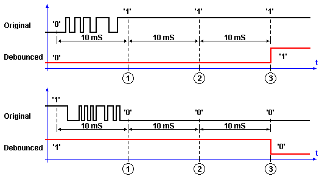

## A low-pass filter switch debouncer function for GPIO inputs {#mainpage}

Repository [https://github.com/8bitgeek/debounce](https://github.com/8bitgeek/debounce)   
Website [https://8bitgeek.github.io/debounce](https://8bitgeek.github.io/debounce)   

### Non-blocking switch debouncer general characteristics 

A non-blocking low-pass filter function used for contact switch debouncing in embedded firmware applications.

A user provided timer callback provides the millisecond counter used as the timebase.

A user provided callback provides a means to read the current hardware GPIO state.

A user provided application callback to notify the application of a (debounced) change in pin state.

A service routine that must be called from the main application loop at a frequency equal to or greater than the user provided timer frequency.

### Theory of operation

The filter consists is a bit buffer word and corresponding bit mask.

Upon each sample period, determined by a platform dependent counter frequency, the physical input is sampled and shfited into the sample buffer.

If the sample buffer contains a mixture of 1s and 0s, then the output state is considered indeterminate, and is ignored.

When the sample buffer transitions to either all 1s or all 0s, then the output state transitions accordingly.

If the application callback is non-null, the callback is executed upon each transition of filtered input state.

### Usage Example

~~~~
#include "debounce.h"
#include <my_timer.h>

#define FILTER_DEPTH 10 /**< Specifices the duration of the low pass filter in units of timer ticks */

debounce_t debounce;    /**< An instance that maintain the debounce state for the input channel */

static debounce_tick_t read_timer_callback(void);
static bool state_changed_callback(void);
static void read_gpio_callback(debounce_t* debounce);

int main(int argc,char*argv[])
{

    debounce_setup( &debounce,
                    FILTER_DEPTH,
                    read_timer_callback,
                    read_gpio_callback,
                    state_changed_callback
                );

    for(;;)
    {
        debounce_service(&debounce);
    }
}

/* 
 * @brief perform platform specific timer read function.
 * @return the value of an unsigned millisecond counter.
 */
static debounce_tick_t read_timer_callback(void)
{
    return my_read_millisecond_counter();
}

/**
 * @brief A callback function that reads the current state of a GPIO input
 * using a platform-specific read.
 * @return true if logic 1 is read, or false if logic  0 is read from the GPIO.
 */
static bool read_gpio_callback(void)
{
    /* 
     * perform a platform-specific GPIO read and translate to a bool type 
     */
    return my_read_gpio_pin() ? true : false;
}

/**
 * @brief The application callback function. Perform an application-level
 * action basedd on the input state transition.
 */ 
static void state_changed_callback(debounce_t* debounce)
{
    if ( debounce_state(debounce) )
        printf("pressed");
    else
        printf("released");
}

~~~~